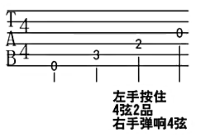

# 吉他自学指南

URL: https://list.youku.com/albumlist/show?id=22806470&ascending=1&page=1

## 001 ##

URL: https://v.youku.com/v_show/id_XNzc0MDY1MDEy.html?spm=a2h1n.8251843.playList.5~5~A&f=22806470&o=1

### 吉他选择

男：41寸民谣吉他  
女：40寸民谣吉他

### 电子调音器

### 变调夹

### 节拍器

锻炼节奏感

### 琴弦和拨片

## 002、认识吉他 ##

民谣吉他

吉他的结构：

- 琴头（6个弦钮，调节琴弦松紧，音高也会发生变化）
- 上弦枕
- 琴颈
- 品柱（也叫品丝）
- 固弦钮
- 琴码

最细的是1弦，最粗的是6弦。

吉他的类型：D型、A型、J型、OM型，初学者建议使用D型民谣吉他

D型吉他，标准为41寸

41寸民谣吉他

- 云杉面板
- 电子调音器（琴头调音器）
- 变调夹
- 节拍器（电子节拍器 ziko）
- 琴弦和拨片
- 好的教材
- 好的平台

## 003、如何给吉他调音 ##

URL: https://v.youku.com/v_show/id_XNzc0MDY3NDY4.html?spm=a2h0j.11185381.listitem_page1.5!3~A&&f=22806470

音高 youtube听一下什么区别
音高、唱名 和 音名的区别

**六根琴弦的音高**

**音名和唱名**：

左边低，右边高，低多少呢？用**全、半音**来表示。

半音：

全音：其他的都是**全音**。

半音：就是相邻的品，例如从第1品到第2品；
全音：从第1品到第3品，就是一个全音

**调音的方法**：电子调音器调音，放在琴头

## 004、拨弦方法

URL: https://v.youku.com/v_show/id_XNzc0MDY4ODk2.html?spm=a2h0j.11185381.listitem_page1.5!4~A&&f=22806470

6/5/4弦都是用大拇指向下拨的。

拨完6弦，落到5弦；  
拨完5弦，落到4弦；  
拨完4弦，落到3弦。  

3弦，是食指向上拨，用指甲和指肚。  
2弦，是用中指向上拨动。  
1弦，是用无名指上拨动。  

手型：大拇指靠前，眼睛能够看到3个手指（食指、中指、无名指）的正面。

第一个练习：6个弦的弹法

## 005、认识六线谱 ##

URL: https://v.youku.com/v_show/id_XNzc0MDczODYw.html?spm=a2h0j.11185381.listitem_page1.5!5~A&&f=22806470

吉他品柱不好按，怎么办？

- 和弦图
- 右手指法谱（x号标记）
- 简谱 0 1 2 3 4 5 6 7
- 歌词

标准的吉他弹唱谱，如下

规范的扫弦谱，如下

接下来，认识**六线谱**。

6条线代表6个弦

形象展示

指法谱上的几个数字

接下来，认识**和弦图**。

和弦名称

6条线代表6根琴弦

形象展示

此弦不发出声音

前三品

和弦内音（简单的理解，可以忽略这个圆圈）

“指法谱”中的“数字”代表几品；
“和弦图”中的“数字”代表左手的代号

左手代号如下：

用代号为1的手指放在第2弦的第一品上

右手代号，如下图

代号为1的手指把6根弦都摁住,这叫做封闭和弦

从7品开始

下面这个是和弦图显示了4品（一般是显示3品）

一个弹的示例：

5、3、2、3  
1、3、2、3

扫弦

4->1 用食指的指甲  
1->4 用大拇指

第二个练习：C和弦  
第三个练习：53231323

## 006、七音阶练习 ##

URL: https://v.youku.com/v_show/id_XNzc0MDc2NDEy.html?spm=a2h0j.11185381.listitem_page1.5!6~A&&f=22806470

**六根琴弦的音高**

**音名和唱名**：

第四人练习：七音阶

1234567唱名 
CDEFGAB音名

do re mi fa so la xi do
唱名与数字对应
唱名与字母对应

1 2 3 4 5 6 7
7 6 5 4 3 2 1

1 2 3 4 5 6 7 6 5 4 3 2 1
7 6 5 4 3 2 1 2 3 4 5 6 7

1 3 5 7 2 4 。。。
7 3 5 1 4 2
5 3 4 2 7 1
2 4 1 3 5 7
2 4 7 5 3 1

读5次

11111

